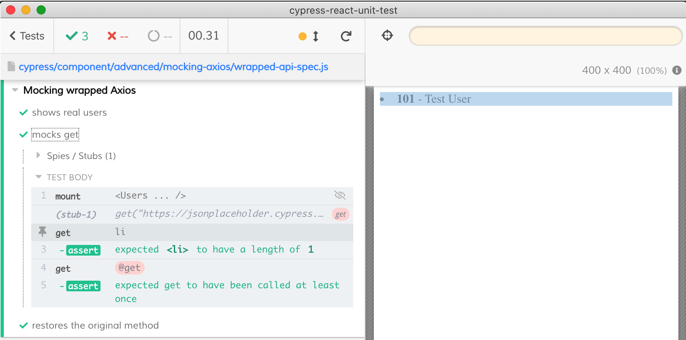

# Mocking CommonJS modules

Imagine your component is importing a CommonJS module from `node_modules` that you want to mock from the test.

## Object

- mocking methods called from the component like

```js
// component code
import axios from 'axios'
axios.get('...')
// spec code
import * as Axios from 'axios'
cy.stub(Axios, 'get')
```

## Named

- mocking named ES6 imports

```js
// component code
import { get } from 'axios'
get('...')
// spec code
import * as Axios from 'axios'
cy.stub(Axios, 'get')
```

## Wrapped

- mocking wrapped module

You can also wrap module from `node_modules` and mock the wrap

```js
// wrapper code
export * from 'axios'
// component code
// import wrapped Axios method
import { get } from './axios-api'
// spec code
import * as Axios from './axios-api'
```


