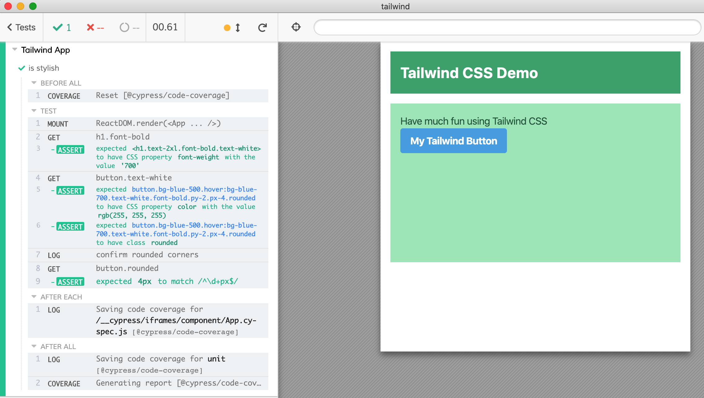

# example: tailwind

Component testing when using [Tailwind CSS](https://tailwindcss.com/), example created following the blog post [Using Tailwind CSS With React](https://medium.com/codingthesmartway-com-blog/using-tailwind-css-with-react-ced163d0e9e9) and Tailwind's own documentation.

## Installation

Run `npm install` in this folder to symlink `cypress-react-unit-test` dependency first.

```shell
npm install
```

## Run tests

You can execute `npm run build:css` to let Tailwind generate `src/styles/main.generated.css` or run Cypress, since this step is set as a pre-test step inside [package.json](package.json).

```shell
npm run cy:open
# or just run headless tests
npm test
```

## Tests

- [src/App.cy-spec.js](src/App.cy-spec.js) tests component [src/App.js](src/App.js) that uses Tailwind style bundle `src/styles/main.generated.css`


