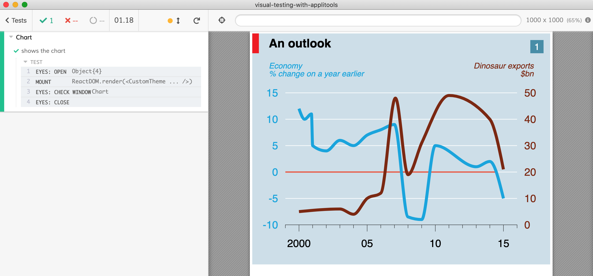

# example: visual testing using Applitools

Shows how to use Applitools to visually check React charts made with [Victory](https://formidable.com/open-source/victory/) library.

See [src/Chart.spec.js](src/Chart.spec.js)
